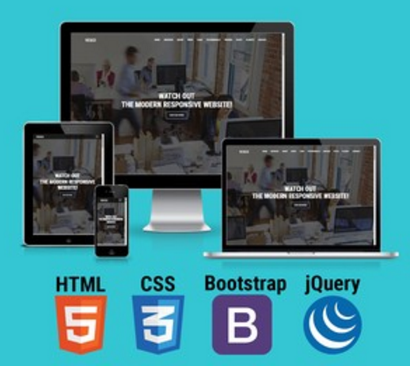

# Build Modern Responsive Website With HTML5, CSS3 & Bootstrap

In this course we will build a modern responsive website from scratch called Vesco with HTML5, CSS3, jQuery, and Bootstrap.

First, we write HTML5 markup the best way with integration of Bootstrap framework which helps to speed up the development time and allows us to add some really great features to a website.

We will also learn new CSS3 techniques to style a website and get introduced to some new concepts such as CSS3 media quires & breakpoints. Finally, we add cool features to the website with jQuery.
